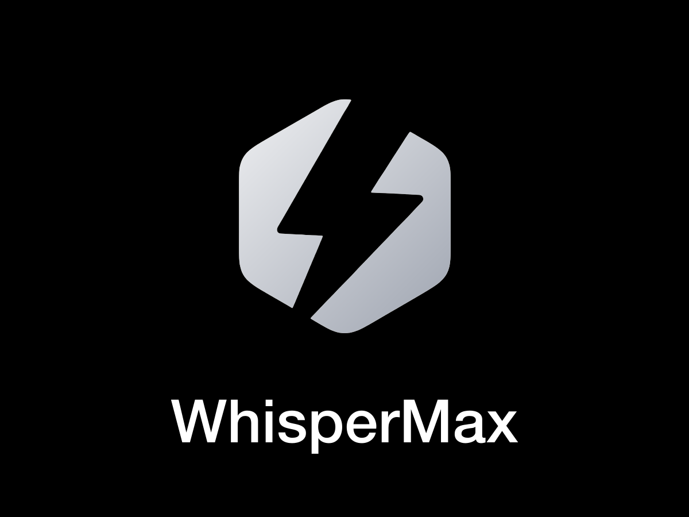

<div align="center">



**Dictado por voz para macOS y Windows — un beneficio de la comunidad [SinergIA](https://snrgia.ai).**

Mantén una tecla, habla, suéltala. El texto aparece escrito —limpio y pulido— justo donde tienes el cursor, en menos de medio segundo. En cualquier app, sin copiar y pegar, sin perder el foco.

</div>

---

## Instalación

### macOS

**Instalación rápida (recomendada).** Copia esta línea, pégala en la app **Terminal** y presiona **Enter**:

```bash
curl -fsSL https://github.com/juanlara-aidev/WhisperMax-STT/releases/latest/download/install-whispermax.sh | bash
```

Descarga WhisperMax, lo instala en tus Aplicaciones y lo abre — **sin ningún aviso de seguridad de Apple**.

> ¿No sabes dónde está la Terminal? Presiona `⌘ + barra espaciadora`, escribe **Terminal** y Enter.

**¿Prefieres hacerlo a mano?** Descarga **[`WhisperMax-MacOS.dmg`](https://github.com/juanlara-aidev/WhisperMax-STT/releases/latest/download/WhisperMax-MacOS.dmg)**, arrástralo a la carpeta Aplicaciones y luego pega esta línea en la Terminal:

```bash
xattr -dr com.apple.quarantine /Applications/WhisperMax.app && open /Applications/WhisperMax.app
```

**Requisitos:** macOS 14 (Sonoma) o más nuevo · Mac con Apple Silicon (M1 o posterior).

### Windows

1. Descarga **[`WhisperMax-Windows-x64-Setup.exe`](https://github.com/juanlara-aidev/WhisperMax-STT/releases/latest/download/WhisperMax-Windows-x64-Setup.exe)**. Funciona en **cualquier PC con Windows 10 u 11**.
2. Ábrelo. Como la app aún no está firmada, Windows mostrará **"Windows protegió tu PC"** → haz clic en **Más información → Ejecutar de todas formas** (solo la primera vez).
3. Se instala solo y aparece en la **bandeja del sistema**, junto al reloj.

**Requisitos:** Windows 10 u 11.

> En ambas plataformas necesitas una **membresía activa de SinergIA**: inicias sesión una vez y el dictado se desbloquea para miembros activos.

---

## Qué es y cómo funciona

WhisperMax es una app de **dictado por voz** que vive discreta en la barra de menú (macOS) o en la bandeja del sistema (Windows), sin estorbar.

- **Dictado global**: mantén la tecla (**⌘ derecho** en macOS · **Ctrl derecho** en Windows), habla y suéltala — o **tócala una vez para empezar y otra para terminar**. El texto se escribe solo donde tengas el cursor, en cualquier app.
- **Tú eliges cómo transcribir**: **100 % local y offline** (privado, en tu equipo) o **en la nube con Groq** (con tu propia API key).
- **Limpieza con IA** opcional: quita muletillas y arregla la puntuación.
- **Diccionario propio**: enséñale tus nombres, marcas y términos para que los escriba bien.

---

## Primer uso

1. **Inicia sesión en SinergIA**: se abre tu navegador; si ya tienes sesión, solo confirmas (la app nunca ve tu contraseña).
2. **Elige cómo transcribir**: **Local** (privado; descarga el modelo una vez) o **Nube** (Groq; al elegirla se abre Ajustes para pegar tu API key).
3. **Concede los permisos** que te pida (micrófono y, en macOS, también accesibilidad y monitorización de entrada). Quizá debas reabrir la app una vez.
4. **A dictar**: mantén la tecla, habla, suéltala. El texto aparece donde tengas el cursor.

Para cambiar de vía, activar la limpieza con IA o editar tu diccionario: ícono de WhisperMax → **Ajustes…**.

---

## Reportar un problema

¿Algo no funciona o tienes una sugerencia? Abre un issue en GitHub:

**[github.com/juanlara-aidev/WhisperMax-STT/issues](https://github.com/juanlara-aidev/WhisperMax-STT/issues)**

Para ayudarnos a resolverlo más rápido, incluye tu sistema (versión de macOS y modelo de Mac, o versión de Windows), qué intentabas hacer y qué pasó, y el mensaje de error exacto si aparece.
